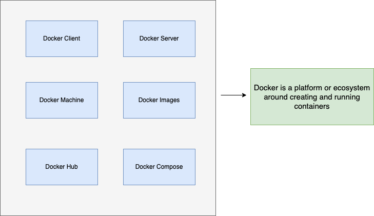
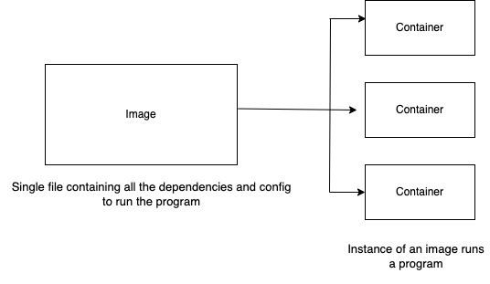
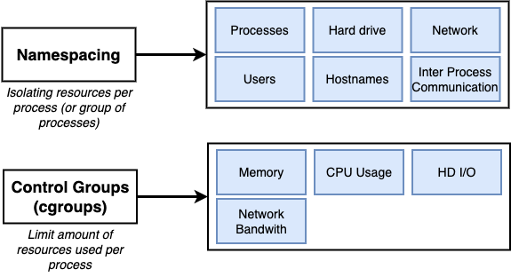
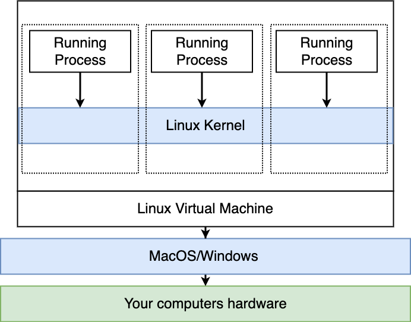
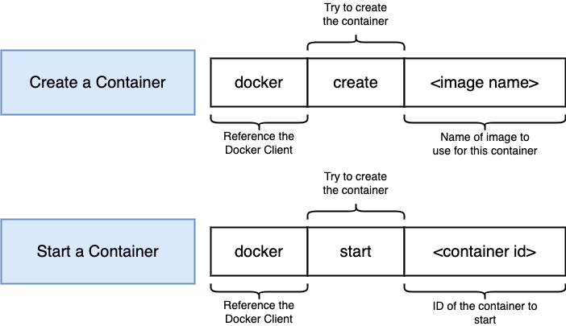
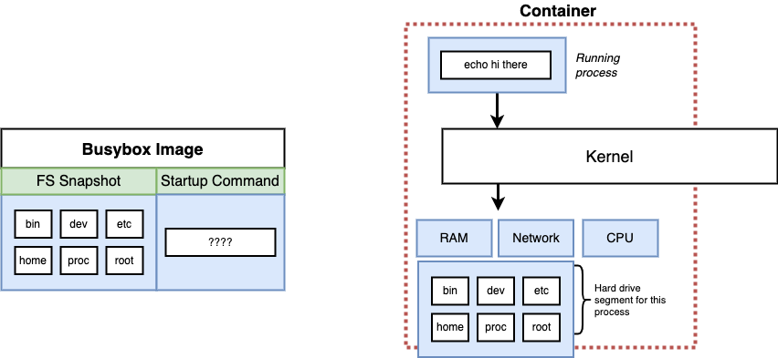
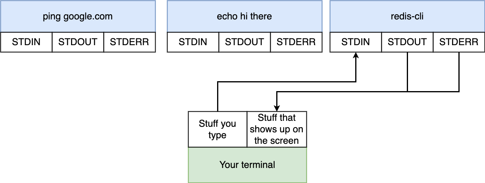
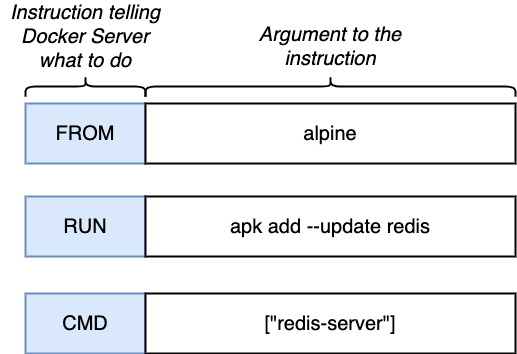
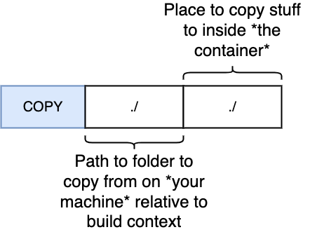

## Course followed - [Docker and Kubernetes: The Complete Guide By Stephen Grider](https://www.udemy.com/course/docker-and-kubernetes-the-complete-guide/)

### Why use docker?

Let's say we are trying to install a software in our PC. But it creates problem sometimes, right? Maybe some broken link or version mismatch etc. So, Docker is trying to solve this problem, so that we don't have to worry about the installation anymore. So, in a nutshell docker makes our life lot more easier installing software without dependencies.

Here are two things two understand clearly.


Using docker we actually get images, which contain all the necessary configurations, properties etc. And we just run the image in a docker, aka - container. And it runs!


Docker is made of two things - 

- Docker client (Docker CLI): It is the tool we will give the command to interact with. It is basically takes our commands.
- Docker server (Docker Daemon): This is under-the-hood that is responsible to create images, running containers etc.

Let's write our first docker command `docker run hello-world`. Then we will see bunch of text there. Most importantly, this `Unable to find image 'hello-world:latest' locally`. 
Actually what the command does, Docker Client takes the coomand, then goes to Docker Server for this image. Docker server searches in its own `Image Cache` for this image. But not found yet. Then, it goes to Docker Hub where all the popular images are already given. It goes there, download it and save in its local 'Image Cache' and gives us the output. Next time, we enter the same command, it won't show the line *Unable to find image 'hello-world:latest' locally*.

Here is a nice overview [here](https://www.udemy.com/course/docker-and-kubernetes-the-complete-guide/learn/lecture/11436632?start=0#overview).

Container basically uses `namespacing`, `control groups` for process separation and OS resource sharing. But the problem is this separation is Linux specific, not in Windows/ Mac. So, how we install docker in mac or windows and it works perfectly? 

Actually when we install docker in mac/linux, it runs on linux subsystem, which contains linux kernel underneath. That's how docker can work there.
 

We can verify running the command `docker version` and see the OS/Arch section, written `linux/amd64`.

#### Overriding docker run

Actually what an image does, it creates a container. And it has a starting section, which is triggered by `docker run`. But we can override it by passing our own command like that `docker run {image} {custom command`.
Like - `docker run busybox ls` / `docker run busybox echo hi there`
If we run these, the container has this ls/echo command installed. That's why it will work. But if we type 
`docker run busybox cd bin` - it will say that `cd` is not found. Same thing is gonna happened if we type 
`docker run hello-world ls` - in the hello-world container, ls is not installed, so it will show that it is not recognizing this command.

#### Listing running containers

What we have seen so far, are the started and immediately stopped with echo something or printing list of things. But sometime, we want our process to run for further.
To list all the currently running container on our machine, type `docker ps`. If we want to see an example, type `docker run busybox ping google.com` in one window. In another window, type *docker ps*. It will show Container Id, image and other details. Here, ID is the important one. We will need it for future reference. If we need to list all the running containers ever on our machine, type 
`docker ps --all`.

#### Docker lifecycle

Actually *docker run* is a combination of two commands,
docker run = docker create + docker start -a {container-id}

docker create creates a container from an image. It gives the container id as output when we run `docker create`. Then `docker start {id}` - runs the container and just exits after running without showing us any output like `docker run`. So, if we want to get a nice output, we need to type, `docker start -a {id}`.
```bash
docker create hello-world
docker start -a {id}
```
`-a` is for attaching. Here is a nice diagram what actually happens under the hood.


We can re-start a container with an ID. Where do we find it? From `docker ps --all`. Same as like before - 
`docker start -a {id}`. But here is an interesting concept. We can't override the default command by `docker start` when restarting. It will execute exact same command (or we can call it re-issuing), when it was first run (by docker run or docker start). We cannot pass something like that - `docker start -a {id} echo hi there`. But what we can - 

```bash
docker run busybox echo hi there
docker ps --all -> get the id
docker start -a {id} -> get the same output from docker run
```
Here if we try something like - `docker start -a {id} echo hello`, it will say that 'you cannot start and attach multiple containers at once'.
Here is nice explanation video - https://www.udemy.com/course/docker-and-kubernetes-the-complete-guide/learn/lecture/11436652#overview


But let's say we are done and want to remove all the stopped containers and images from `docker local cache`. 
So, we type `docker system prune`.

We can run a container background, like this - `docker run -d {image}`. To stop it, we run `docker ps`, grab the id and stop it like normal flow.

#### Collect logs from container

We can get the logs emitted from a container after it is stopped and exited. We saw the output with `docker run`, or `docker start -a {id}`. But there is another way - 
`docker logs {id}`. 

```bash
docker create busybox echo hello there
docker start {id}
docker logs {id}
```

#### Stoping containers

We can stop/kill a container by `docker stop {id}` or `docker kill {id}` command. But what is the difference? 
`docker stop` sends `SIGTERM` signal to the container where `docker kill` sends `SIGKILL` signal. As we already know *SIGTERM* command does not always kill a process but *SIGKILL* always kills a process. But in terms of docker, when we type `docker stop {id}`, it tries to stop and kill the process, if not killed within 10 seconds, it will kill it, that means it will send the SIGKILL signal to the process. Let's see an example. If we type 
```bash
docker create busybox ping google.com
docker start {id} 
docker ps
```
We will see that a docker process is running. `ping` is basically a infinite running process and it does not understand SIGTERM command. So, if we try `docker stop {id}`, it will try to stop within 10 seconds, then it will send SIGKILL signal to kill the process. But if we try `docker kill {id}`, it will immediately kill the process.

#### Execute additional command inside a docker

Let's say, we installed redis inside an image. Now, as usual we want to execute `redis-cli` to store and get value. But how to do this? 
So, let's type - `docker run redis`, now it will create and start the container in that terminal window. But, let's open another window, and type `redis-cli`, no - it won't work. Because, typing redis-cli is trying to find the command in our computer not in that container. So, to execute that command we need to type 
`docker exec -it {id} {command}` -> command = redis-cli or sh or else
exec = execute, it = allow us to provide input into container.
We need to find the container id typing `docker ps`. If we type that above command without `-it` flag, it will start and immediately stop as it is not allowing us to provide input into container.

But the power of `-it` flag is more. Every process has three sections - 

- STDIN - standard input
- STDOUT - standard output
- STDERR - standard error
  
Here is a nice diagram to explain these things.

We can type that `-it` flag separately - `-i -t`. Here i = STDIN, t = nicely formatted input to take. To test, we can type without `-t` command like - `docker exec -i {id} redis-cli`.

#### How to open a shell terminal inside a container

Let's say we want to open a terminal inside a running container. We type - `docker exec -it {id} sh`. `sh` for *shell*. So, then we are inside a shell from inside a container which is running from a shell. Make sure, the container is running on the other terminal, otherwise entering into the container's shell is impossible. It will also work for `docker run busybox ping google.com`, though if we run custom command in there like, `docker run busybox cd bin/` - it will not recognize cd. But if we start it with ping, then call it from other terminal `docker exec -it {id} sh` and entering into shell, we can type `cd` without error. That's the true beauty.

**Note:** How to exit that double shell? `CTRL+D` or `exit` is on the rescue.
There is an alternative for this. We need not to open a extra process for running and start shell in other terminal. We can directly open a shell at container startup with - `docker run -it busybox sh`. The only downside of this approach, we cannot open another process for this like before where we keep running a separate process with `ping` and use terminal from another window. So, both approaches are available, we just follow what we need. 

**Note**: Creating two containers from a single image are two separate VM, so those will not share any memory or RAM or anything. Creating a file inside one container can not be accessible from other container. We can check this with `docker run -it busybox sh` twice, then creating a file inside one, and trying to see from other container. It is easy to understand.

#### Creating a docker file

Here is basic flow of creating a *Dockerfile* (not Dockerfile.js or something)- 

- Specify a base image - use an existing docker image as a base
- Run some commands to install additional programs - download and install a dependency
- Specify a command to run on container startup - tell the image what to do when it starts as a container

Let's create a file named `Dockerfile` with below lines to create an image with redis-server - 

```bash
FROM alpine
Run apk add --update redis
CMD ["redis-server"]
```
Now, give the command `docker build .` in that file's folder. In the output of this command we will see that output `sha:{image-id}`. As usual, just run `docker run {id}`.

Here is a visual of the command.



Let's tear down all these. There is a nice analogy - 
Writing a docker file == Run google chrome on a brand new computer with no OS installed yet. What are we going to do? We install OS at first, that's like `Alpine`, then donwload and install Google Chrome, like - `Run apk add --update redis` and at last, open chrome with chrome.exe is like `CMD ["redis-server"]`. Here is the diagram below - 


But now I may ask why choose `alpine`? Because it comes with some nice pre-installed tools that we need.


`apk` is the package manager which is built into `alpine`.
Here is the nice explanation video what is happening under the hood - https://www.udemy.com/course/docker-and-kubernetes-the-complete-guide/learn/lecture/11436706#overview

And the recap of the video - 


#### Building from a cache

Docker uses cache when to re-build a Dockerfile. Let's say, we add another line `Run apk add --update gcc` into the previous Dockerfile. And run the build command. We will see that it uses `redis` from cache. But it will download and install `gcc` like new thing. Now, let's give the Build command again. We will see that both `redis` and `gcc` are built from cache.
Now, here is the interesting thing. Let's change the order as gcc first and redis second like below - 

```bash
FROM alpine
Run apk add --update gcc
Run apk add --update redis
CMD ["redis-server"]
```
Now, cache is not gonna work and everything will be built from start (may not download but won't use cache).

#### Tagging an image

What we built by `Docker build .` command, as output, it gives an ID. And we run the image by typing - `Docker run {id}`. But as we see in the first place, that we run an image by name, like `docker run hello-world`. So, how can we make our docker so that we can run like that with name. Here is the flow - 


Actually, in there `version` is the `actual tag`. `docker id` and `project name` is like naming convention. So, built command will be 
`docker build -t nowshad/redis:latest .` and run command will be `docker run nowshad/redis` - it will take `latest` tagged image by default. Or we can specify the version in the command like `docker run nowshad/redis:latest`. We can also build Dockerfile without `latest` or just blank, it will be automatically appended at last if we don't add it manually.

**Note**: We may wonder then why `busybox` has no namespace before it? Actually these are popular community images, not belonged to anyone specific. That's why those are written like this. docker-id is long enough. We need not copy the entire thing. Just copy the first 8/10 characters so that Docker can distinguish it from other containers.

#### Generate image from a container

Let's reverse the whole docker from build image -> container to container -> image. Let's open alpine shell at first - `docker run -it alpine sh`. Now, install redis in there `apk add --update redis`. Now, the container has redis installed in there. Let's create an image from this container. Open another terminal while this is running. 

```bash
docker ps -> alpine is running
docker commit -c 'CMD ["redis-server"]' {id}
docker run {new-container-id}
```

### Node JS Project Example

Let's create a new folder for a new nodejs project. Here is the files should be - 
`index.js`
```js
const express = require('express');

const app = express();

app.get('/', (req, res) => {
	res.send('Hi there');
});

app.listen(8080, () => {
	console.log('Listening on port 8080');
});
```

`package.json`

```json
{
	"dependencies": {
		"express": "*"
	},
	"scripts": {
		"start": "node index.js"
	}
}
```
To run this project basically we need to commands `npm install` to install the dependencies, and `npm start` to start it. So, we are gonna do this via Dockerfile.

*We are gonna make some mistakes intentionally.*

`Dockerfile`

```DOCKER
FROM alpine
RUN npm install
CMD ["npm","start"]
```

If we type `docker build .`, we will see an error `ERROR [2/2] RUN npm install`.  Why??
Because, npm is not installed on the Alpine image. To solve this, we have 2 options - 

- Install npm on our Alpine image, like we installed redis earlier.
- Take another image rather than Alpine, which has pre-installed the npm command.

We will go to second option. Let's go to hub.docker.com and find node image. There are different types of versions available. Here `alpine` versions are most minimal. So, we will take this and update our Dockerfile.
`FROM node:14-alpine`

**Note**: Every popular image has an alpine version which contains minimal pre-installed things.

So, now let's build the Dockerfile again. It is working on my mac :P. But in the tutorial, it seems `RUN npm install` is broken when building, as npm is not finding any package.json inside the container. Because our package.json and index.js is on the outside of the container and there is no connection between our outside's files to container's inside npm command. So, we need to link between those. 

But in my mac when I open a terminal into that container I found that a `package-lock.json` is already there in the `/` folder. So, I think npm finds its package-lock.json file and runs it without error. But, if we run the image by `docker run {id}`, we will see that error. 

So, let's copy our local files to container's directory with this command in the Dockerfile above `RUN npm install` - `COPY ./ ./`. So, the Dockerfile will be - 

```Docker
FROM node:14-alpine
COPY ./ ./
RUN npm install
CMD ["npm","start"]
```

Here is the flow - 


Let's try again - 
```docker
Docker build -t nowshad/node .
docker run nowshad/node
```

It will start listening on port 8080. But if we type localhost:8080 from our machine's browser, nothing would happen. Because that server is on a container that has no connection outside of that. 


So, we need to configure the port like below 
`docker run -p 8080:8080 {image}`


Now, if we hit from our browser, it will work fine. 
We can change the port as our need, it is not strictly binded to anything.

But what if we don't want to copy our miachine's files to the root directory of container? We want to change it with `WORKDIR` command, like below - 

```docker
FROM node:14-alpine
WORKDIR /usr/app
COPY ./ ./
RUN npm install
CMD ["npm","start"]
```
Interestingly, now from the `WORKDIR /usr/app` command, everything will need to re-install again, can not use the cached version.

if we now use `docker run -it {image} sh`, we will go to directly to that `usr/app` folder. If the folder does not exist, it will automatically run.

#### Minimise image re-builds and uses cache more

So far we understand that, writing command maintaining order in docker file is important. And sometimes, it uses cache or build from scratch. Let's say we just changed our `index.js` file, but if we re-build it, it will run the command again for `RUN npm install`, as it saw the changes in earlier line.  And `npm install` is a time consuming command. For large projects, it may take several minutes to run. So, if we dont't change the package.json file, why would bothering re-run `npm install`? So, how to minimise it or just configure it so that npm install will only run if package.json is changed? We can change our Docker file like this. 

```docker
FROM node:14-alpine
WORKDIR /usr/app
COPY ./package.json ./
RUN npm install
COPY ./ ./
CMD ["npm","start"]
```
So, if we build first time, it's gonna run `npm install`. But if then change something in `index.js` file and re-build again, we will see that `npm install` is now cached. 
So, we need to write Dockerfile with care.

### Example 1

We are building an web application which is installed in a container and use redis cache installed in separate container.
`package.json` file - 

```json
{
	"dependencies": {
		"express": "*",
		"redis": "2.8.0"
	},
	"scripts": {
		"start": "node index.js"
	}
}
```

`index.js`

```js
const express = require('express');
const redis = require('redis');

const app = express();
const client = redis.createClient();
client.set('visits', 0);

app.get('/', (req, res) => {
	client.get('visits', (err, visits) => {
		res.send("number of visits is " + visits);
		client.set('visits', parseInt(visits) + 1);
	})
});

app.listen(8081, () => {
	console.log('Listening on port 8080');
});
```

`Dockerfile`

```docker
FROM node:14-alpine
WORKDIR /app
COPY ./package.json ./
RUN npm install
COPY . .
CMD ["npm","start"]
```

Let's build the image by running - 

```docker
docker build -t nowshad/visits .
docker run {image name}
```

But we will see an error message like that -

```error
events.js:377
      throw er; // Unhandled 'error' event
      ^

Error: connect ECONNREFUSED 127.0.0.1:6379
```

This error means, we don't have any connection to redis yet. So, let's have one from DockerHub, running it another window `docker run redis`. And let's try again to run the previous image. 
No! same error like before. Because, those two things are running in two containers. So, we need some networking staff to connect between two containers. Two things we can do - 

- Docker CLI - We can use our basic docker CLI commands to configure the networking.
- Docker compose - In industry, docker compose is widely used. We will use it here. Docker compose is a kind of pre-defined commands already built in there. Still now, we used many Docker CLI commands for different use cases. But if we use docker-compose for those cases, commands would be little easier. 

Here are some basic things about docker-compose.

- `version` - the version we are gonna use of docker-compose.
- `-` - array, can use defining ports.
- `services` - where we write the docker images 

So, let's create a docker compose file, like below - 
`docker-compose.yml`. 

```yml
version: '3'
services:
  redis-server:
    image: 'redis'
  node-app:
    build: .
    ports:
      - "4001:8081"
```
`ports` section is like before - {our machine port}:{container port}.
**Note**: `yml` files maintain indent like python. So, we have to be careful enough to write anything there.

We have to connect a redis app to out node app via networking, right? So, how to do this? As we are using docker-compose, it gonna start the two containers in single network. So, we don't need any configuration to configure in the yml file. But we have to specify in our index.js file where to connect for redis-client. 

```js
const client = redis.createClient({
	host: 'http://my-redis-server.com',
	port: '6379'
});
```
But as are using docker-compose and those are maintained bu this, so we can write like below - 

```js
const client = redis.createClient({
	host: 'redis-server', -- name of the service used in docker-compose
	port: '6379'
});
```

As we said earlier, docker-compose is a kind of easier version of docker cli. So, here are some - 

`docker run {image}` = `docker-compose up`
`docker build .` + `docker run {image}` = `docker-compose up --build`

Let's run `docker-compose up`.
We will see some nice outputs like 

```info
Creating network "visits_default" with the default driver
```

And, it's working fine now.
Interestingly, if we type `docker ps`, we will see two containers up and running. So, it must be tempting to stop multiple containers individually (yes, we can type CTRL+C and it will work but not healthy - see the ouput when do this). So, there is another command to stop - `docker-compose down`. To run background a docker-compose, type `docker-compose up -d`. Up-down are opposite, to remember it easily.

Let's say our node app is crashed. And totally get down or exited. Then what to do. Let's create the scenario at first. Let me add some code in index.js file - 

```js
const process = require('process');

app.get('/', (req, res) => {
	process.exit(0);
	client.get('visits', (err, visits) => {
		res.send("number of visits => " + visits);
		client.set('visits', parseInt(visits) + 1);
	})
});
```
Now if we hit the base url, app will be crashed and exited. Let's run the command `docker-compose up --build` as we changed the index.js file a bit. Now, hit the url - http://localhost:4001/. We will see something like this - `visits_node-app_1 exited with code 0`. If we run `docker ps`, we will see just one redis server is now running.

But amy we start the server automatically? Here are some restart policies - 

- no - never attempt to restart this, it crashes or stops
- always - if the container stops for no reason, always attempt to restart it.
- on-failure - Only restart this if container stops with an error code
- unless-stopped - always restarts unless we (developers) forcibly stop it

So, let's try one. Add line like below - 

```docker
node-app:
    restart: always
    build: .
    ports:
      - "4001:8081"
```

we can also write restart policy to redis-server. So, re-run the command `docker-compose up`. Now, if we hit the url, we will see in the command line, 

```info
visits_node-app_1 exited with code 0
node-app_1      | 
node-app_1      | > @ start /app
node-app_1      | > node index.js
node-app_1      | 
node-app_1      | Listening on port 8080
```

That means it was stopped, but again restarted by the docker-compose.

We can also try `on-failure`. But for that we need to change the exit code rather than 0. Because, 0 means - nothing bad happened, we just normally exited the process. But on-failure only works if any failure happens. So, giving a code like  1/2 or anything would give the behavior.

`unless-stopped` only works, if we don't stop process with `docker-compose down` or something else.

For `no`, we must use quote beside this, like - `'no'` or `"no"`. Because, in yml file, `no` means false. So, we need to specify that value as string.

**always vs on-failure**: If we have an web server that should always be running and up, we should use `always` policy. But let's say we are using kind of background service that gets the job done and exit with 0, then we can use `on-failure` policy.

**Note**: `docker-compose ps` gives the *almost* same thing like `docker ps`. But, remember that docker-compose commands only works if that folder contains a docker-compose.yml file.  And with the containers the file contains but `docker ps` is for all. So here is the limitation of docker-compose. If we run docker-compose in a folder that does not contain that yml file, we will get an error.