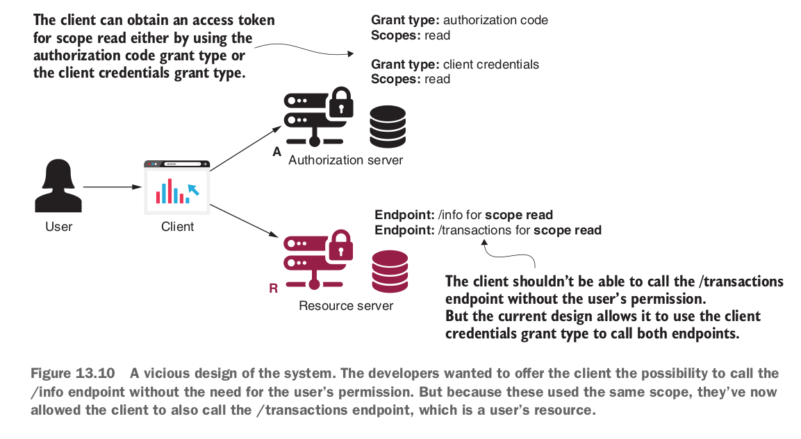

### Chapter 13: Implementing the authorization server

In the previous chapter we used GitHub as Authorization server and resource server. But in this chapter we will build similar authorization server so that it can issue `access_token` based on below grants - 

- Authorization code
- password
- client credentials

With the token, client can access the resouces. That authorization server will also provide `refresh_token` so that after access_token's expiry it can ask the authorization server to provide a brand new access_token with a new refresh_token.

#### Writing your own authorization server implementation
There is no OAuth 2 flow without authorization server. It is kind of a very core component.

Let's add library in build.gradle file. Here we use Spring 2.7.

```groovy
plugins {
    id 'java'
    id 'org.springframework.boot' version '2.7.10'
    id 'io.spring.dependency-management' version '1.1.0'
}
sourceCompatibility = '11'
dependencyManagement {
	imports {
        mavenBom 'org.springframework.cloud:spring-cloud-starter-parent:Hoxton.SR10'
	}
}

dependencies {
    implementation 'org.springframework.cloud:spring-cloud-starter-oauth2'
}
```

Now, we let's create a config class like below - 

```java
@Configuration
@EnableAuthorizationServer
public class AuthServerConfig extends AuthorizationServerConfigurerAdapter {

}
```
Now, we have setup Authorization server to authenticate our users. Here is the basic flow as we know it earlier. 


But remember? we needed to register a client (our application) to GitHub authorization server in chapter 12. Now, we are setting up our own authorization server. So, we also need to setup a client with client_id, client_secret. This client will get the protected resource on behalf of the user.
Interestingly, the client contract is like the user contract, `ClientDetails`, `ClientDetailsService`, `InMemoryClientDetailsService`, `JdbcClientDetailsService`.


We can write another section in `AuthServerConfig` class.

```java
    @Override
    public void configure(ClientDetailsServiceConfigurer clients) throws Exception {
        var service = new InMemoryClientDetailsService();
        var cd = new BaseClientDetails();
        cd.setClientId("client");
        cd.setClientSecret("secret");
        cd.setScope(List.of("read"));
        cd.setAuthorizedGrantTypes(List.of("password"));
        service.setClientDetailsStore(
                Map.of("client", cd));
        clients.withClientDetails(service);
    }
```
Or, we can write a cleaner method like below - 

```java 
   @Override
    public void configure(ClientDetailsServiceConfigurer clients) throws Exception {
        clients.inMemory()
                .withClient("client")
                .secret("secret")
                .authorizedGrantTypes("password")
                .scopes("read");
    }
```
Now let's autowire the AuthenticationManager in this class.

```java
   @Autowired
    private AuthenticationManager authenticationManager;

    @Override
    public void configure(AuthorizationServerEndpointsConfigurer endpoints) {
        endpoints.authenticationManager(authenticationManager);
    }
```
Let's write our WebSecurityConfig class like before - 
```java
@Configuration
public class WebSecurityConfig extends WebSecurityConfigurerAdapter {
    @Bean
    public UserDetailsService uds() {
        var uds = new InMemoryUserDetailsManager();
        var u = User.withUsername("john").password("12345").authorities("read").build();
        uds.createUser(u);
        return uds;
    }

    @Bean
    public PasswordEncoder passwordEncoder() {
        return NoOpPasswordEncoder.getInstance();
    }

    @Bean
    public AuthenticationManager authenticationManager() throws Exception {
        return super.authenticationManager();
    }
}
```
Note: we use `spring 2.7.10` and `java 11` in this case.
Now let's curl and get the token - 
```curl
curl -v -XPOST -u client:secret http://localhost:5050/oauth/token?grant_type=password\&username=john\&password=12345\&scope=read
```
We will get data like below -

```json
{"access_token":"1178a915-7eb1-48bc-9103-43cd8332ccaa","token_type":"bearer","expires_in":41464,"scope":"read"}
```

Now, let's try another grant_type - authorization_code.
Let's change the AuthServerConfig class like below - 

```java
clients.inMemory()
                .withClient("client")
                .secret("secret")
                .authorizedGrantTypes("authorization_code")
                .scopes("read")
                .redirectUris("http://localhost:9090/home");
```
Let's enable form login the WebSecurityConfig - 

```java
 @Override
    protected void configure(HttpSecurity http)
            throws Exception {
        http.formLogin();
    }
```
Now, in browser open the link - http://localhost:5050/oauth/authorize?response_type=code&client_id=client&scope=read
It will give the form login page to `authenticate user`. After giving user's credentials, it will navigate us to approve/ deny section for approving the client for read scope.
If we approve that, it will redirect us - http://localhost:5050/home?code=qeSLSt. And we got the `code`. Now, we will hit another curl - 

```curl
curl -v -XPOST -u client:secret http://localhost:5050/oauth/token?grant_type=authorization_code\&scope=read\&code={code}
```
It will give us the access token like before.


```json
{"access_token":"1178a915-7eb1-48bc-9103-43cd8332ccaa","token_type":"bearer","expires_in":41464,"scope":"read"}
```

Now, let's try for grant_type = client_credentials, it does not include client's interaction. It directly asks for some non-sensitive info.
Let's change the AuthServerConfig like below, and remove the form login from WebSecurityConfig. And this grant_type is also used for backend-to-backend communication.

```java
  clients.inMemory()
                .withClient("client")
                .secret("secret")
                .authorizedGrantTypes("client_credentials")
                .scopes("info");
```
And hit the curl with - `curl -v -XPOST -u client:secret http://localhost:5050/oauth/token?grant_type=client_credentials&scope=info`.
And we will be given the access_token like before.

But we need to be extra careful about this grant type, as it does not ask for user's credentials. A picture is given below - 



Now, we can try with grant_type = refresh_token. Let's change the code like below - 


And try with curl - 

```curl
curl -v -XPOST -u client:secret http://localhost:5050/oauth/token?grant_type=password\&username=john\&password=12345\&scope=read
```

We will get extra value `refresh_token` like below - 
```json
{"access_token":"9e189112-8e55-45c7-9867-bed997f372be","token_type":"bearer","refresh_token":"2f763c49-fb25-41fb-af13-f7989df32a2d","expires_in":43199,"scope":"read"}
```

