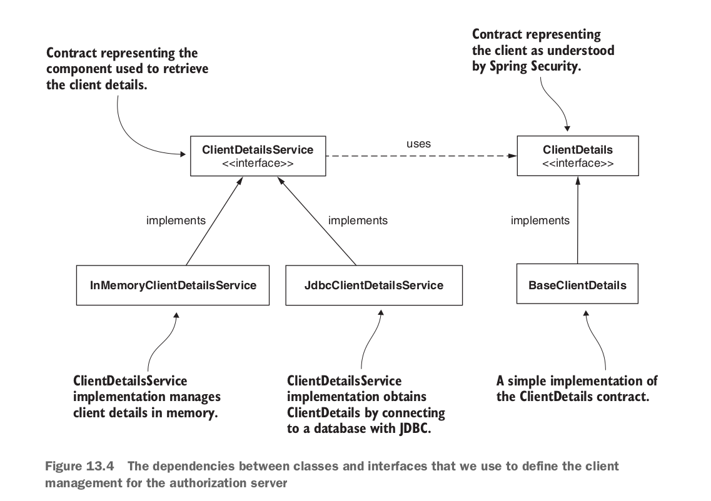

### Chapter 13: Implementing the authorization server

In the previous chapter we used GitHub as Authorization server and resource server. But in this chapter we will build similar authorization server so that it can issue `access_token` based on below grants - 

- Authorization code
- password
- client credentials

With the token, client can access the resouces. That authorization server will also provide `refresh_token` so that after access_token's expiry it can ask the authorization server to provide a brand new access_token with a new refresh_token.

#### Writing your own authorization server implementation
There is no OAuth 2 flow without authorization server. It is kind of a very core component.

Let's add library in build.gradle file

```groovy
dependencyManagement {
	imports {
		mavenBom 'org.springframework.cloud:spring-cloud-dependencies:Hoxton.SR1'
	}
}

dependencies {
    implementation 'org.springframework.cloud:spring-cloud-starter-oauth2'
}
```

Now, we let's create a config class like below - 

```java
@Configuration
@EnableAuthorizationServer
public class AuthServerConfig extends AuthorizationServerConfigurerAdapter {

}
```
Now, we have setup Authorization server to authenticate our users. Here is the basic flow as we know it earlier. 


But remember? we needed to register a client (our application) to GitHub authorization server in chapter 12. Now, we are setting up our own authorization server. So, we also need to setup a client with client_id, client_secret. This client will get the protected resource on behalf of the user.
Interestingly, the client contract is like the user contract, `ClientDetails`, `ClientDetailsService`, `InMemoryClientDetailsService`, `JdbcClientDetailsService`.



We can write another section in `AuthServerConfig` class.

```java
    @Override
    public void configure(ClientDetailsServiceConfigurer clients) throws Exception {
        var service = new InMemoryClientDetailsService();
        var cd = new BaseClientDetails();
        cd.setClientId("client");
        cd.setClientSecret("secret");
        cd.setScope(List.of("read"));
        cd.setAuthorizedGrantTypes(List.of("password"));
        service.setClientDetailsStore(
                Map.of("client", cd));
        clients.withClientDetails(service);
    }
```
Or, we can write a cleaner method like below - 

```java 
   @Override
    public void configure(ClientDetailsServiceConfigurer clients) throws Exception {
        clients.inMemory()
                .withClient("client")
                .secret("secret")
                .authorizedGrantTypes("password")
                .scopes("read");
    }
```

